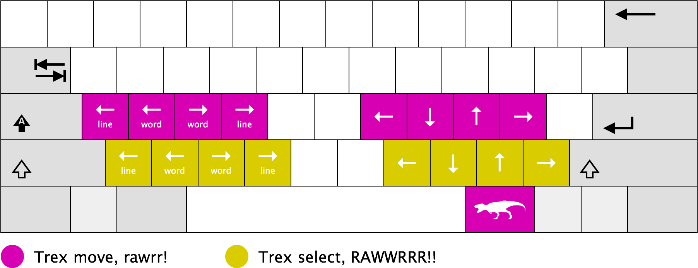

# Trexkeys

You shouldn't need to move your arm just to move your cursor. For those who
won't (or can't), there's Trexkeys: keyboard mappings for home row navigation

# Usage

1. Hold the Trexkey (the key directly to the right of your spacebar)
2. Press a home row key to move the cursor
3. Press a key below the home row to both move the cursor, and select text
4. Rawwrrrr!

# Installation

## Windows

Shortcuts on Windows are implemented using [AutoHotKey](http://www.autohotkey.com/).

Coming soon!

## Mac OS X

Shortcuts on OS X are implemented using [Karabiner](https://pqrs.org/osx/karabiner/).

Install Karabiner, and then copy `private.xml` to `~/Library/Application\ Support/Karabiner/private.xml`,
then open Karabiner preferences, click on the "Reload XML" button, and finally
search for and enable the "Trexkeys" keymapping.

## Linux

Shortcuts on Linux are implemented using a combination of [Xmodmap](https://wiki.archlinux.org/index.php/Xmodmap)
to define a new modifier key, and a set of [Autokey](https://code.google.com/p/autokey/) scripts to define the new mappings.

Coming soon!

# Attributions

* Keyboard template by [Gerbrant](https://commons.wikimedia.org/wiki/User:Gerbrant) is licensed under CC BY-SA 3.0
* Tyrannosaurus icon made by [Freepik](http://www.freepik.com) is licensed under CC BY 3.0
