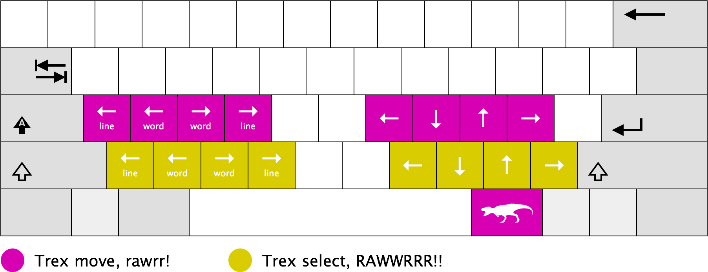

# Trexkeys

You shouldn't need to move your arm just to move your cursor. For those who
won't (or can't), there's Trexkeys: keyboard mappings for home row navigation

# Usage

1. Hold the Trexkey (the key directly to the right of your spacebar)
2. Press a home row key to move the cursor
3. Press a key below the home row to both move the cursor, and select text
4. Rawwrrrr!

# Installation

## Windows

Shortcuts on Windows are implemented using [AutoHotKey](http://www.autohotkey.com/).

1. Install AutoHotKey
2. Find the appropriate `.ahk` file inside the `windows` folder for your keyboard layout - if unsure, use "Standard"
3. Double click the AHK to run it - it will show up as an "H" icon in your system tray
4. You're ready to use Trexkeys!
5. Copy the AHK to your Startup folder to have it run automatically on startup (To find the startup folder, press Win+R,
then type `shell:Startup`)

## Mac OS X

Shortcuts on OS X are implemented using [Karabiner](https://pqrs.org/osx/karabiner/).

1. Install Karabiner
2. Copy `mac/private.xml` to `~/Library/Application\ Support/Karabiner/private.xml`
3. Open Karabiner preferences
4. Click on the "Reload XML" button
5. Search for and enable the "Trexkeys" keymapping
6. You're ready to use Trexkeys!

## Linux

Shortcuts on Linux are implemented using a combination of [Xmodmap](https://wiki.archlinux.org/index.php/Xmodmap)
to define a new modifier key, and a set of [Autokey](https://code.google.com/p/autokey/) scripts to define the new mappings.

Coming soon!

# Attributions

* Keyboard template by [Gerbrant](https://commons.wikimedia.org/wiki/User:Gerbrant) is licensed under CC BY-SA 3.0
* Tyrannosaurus icon made by [Freepik](http://www.freepik.com) is licensed under CC BY 3.0
